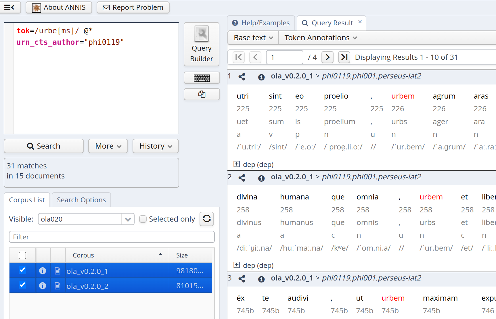

# Query the Corpus

The annotations in OLA can be queried using the original PAULA XML files 
or ANNIS 4. 
In either case, one must know the labels used to encode annotations
(for example, `v` stands for verbs and `n` for nouns). The files in this
folder document the admissible keys and values.

## ANNIS 4

Annis query language is documented 
at https://korpling.github.io/ANNIS/4/user-guide/aql/index.html. 
What is important to undestand for querying in ANNIS 4
is that there are two
kinds of annotation that two kinds of syntax correspond to: 
the annotation associated with single tokens (*token-based*) and 
the annotation associated with all tokens of a text (*text-based*, 
known also as *metadata field*). For example, the field `author`
is the same for all tokens of a text and therefore is a metadata field. 

In ANNIS 4, annotations associated with single tokens (token-based) are simply
searched using key/value pairs, such as `tok="urbem"` or 
`lemma="praesagium"`. Metadata fields are also accessed through key/value pairs, 
but are introduced by the operator `@*` (e.g., `@* urn_cts_author="tlg0010"`).
For more clarification, [query examples](#annis-query-examples) are 
provided below as templates. The following table lists 
all possible search keys and their values:

|type of annotation|syntax|comment/values|
|-----|-----|-----|
|token-based|`tok="urbem"`|this is a word form (UTF-8, NFC-normalized)|
|token-based|`lemma="praesagium"`|lemmas (UTF-8, NFC-normalized)|
|token-based|`pos="v"`|part of speech; see values in `morphology.md`|
|token-based|`person="2"`|morphological feature; see values in `morphology.md`|
|token-based|`number="s"`|morphological feature; see values in `morphology.md` |
|token-based|`tense="p"`|morphological feature; see values in `morphology.md` |
|token-based|`mood="i"`|morphological feature; see values in `morphology.md` |
|token-based|`voice="a"`|morphological feature; see values in `morphology.md` |
|token-based|`gender="m"`|morphological feature; see values `morphology.md` |
|token-based|`case="n"`|morphological feature; see values in `morphology.md` |
|token-based|`degree="m"`|morphological feature; see values `morphology.md` |
|token-based|`cts="1_2"`|  see values in `table_keys_values.md` |
|token-based|`ipa01="/ˈdo.mus/"`| experimental IPA transcription ("Classical Latin"); see examples from Wiktionary, such as <a href="https://en.wiktionary.org/wiki/domus#Latin">domus</a>| 
|text-based|`@* urn_cts="phi0448.phi001.perseus-lat2"`| see `table_keys_values.md` |
|text-based|`@* urn_cts_author="phi0448"`| see values in `table_keys_values.md` |
|text-based|`@* urn_cts_work="phi001"`| see values in `table_keys_values.md` |
|text-based|`@* urn_cts_edition="perseus-lat2"`| see values in `table_keys_values.md` |
|text-based|`@* author="Julius Caesar"`| see values `table_keys_values.md` |
|text-based|`@* title="Gallic War"`| see values in `table_keys_values.md`|

## ANNIS Query Examples

The following are query examples that can be used as templates:

<table>
  <thead>
    <tr>
      <th>Query</th>
      <th>Explanation</th>
    </tr>
  </thead>
  <tbody>
<tr>
<td><a href="https://annis.varro.informatik.uni-leipzig.de/ola020#_q=dG9rPS91cmJlW21zXS8gQCogdXJuX2N0c19hdXRob3I9InBoaTAxMTki&ql=aql&_c=b2xhX3YwLjIuMF8yLG9sYV92MC4yLjBfMQ&cl=5&cr=5&s=0&l=10">tok=/urbe[ms]/ @* urn_cts_author="phi0119"</a></td>
<td>Search for the word form <code>urbem</code> or <code>urbes</code> in the author whose <code>urn_cts_author</code> value is <code>phi0119</code>  (note that a value included in <code>//</code> is a <a href="https://korpling.github.io/ANNIS/4/user-guide/aql/regex.html">regular expression</a>)</td>
</tr>

<tr>
<td><a href="https://annis.varro.informatik.uni-leipzig.de/#_q=cG9zPSJ2IiBfaWRlbnRfIGN0cz0vM18uKi8gQCogYXV0aG9yPSJKdWxpdXMgQ2Flc2FyIiBfaWRlbnRfIHRpdGxlPSJHYWxsaWMgV2FyIg&ql=aql&_c=b2xhX3YwLjIuMF8xLG9sYV92MC4yLjBfMg&cl=5&cr=5&s=0&l=10">pos="v" _ident_ cts=/3_.*/ @* author="Julius Caesar" _ident_ title="Gallic War"</a></td>
<td>Search for all verbs in the 3rd Book of Caesar's Gallic War. Note that <code>_ident_</code> is
used because the keys apply to the same token</td>
</tr>

<tr>
<td><a href="https://annis.varro.informatik.uni-leipzig.de/#_q=bGVtbWE9ImxpYmVyIiBAKiBhdXRob3I9IkNpY2VybyI&ql=aql&_c=b2xhX3YwLjIuMF8xLG9sYV92MC4yLjBfMg&cl=5&cr=5&s=0&l=10">lemma="liber" @* author="Cicero"</a></td>
<td>Search for the lemma <code>liber</code> in Cicero</td>
</tr>

<tr>
<td><a href="https://annis.varro.informatik.uni-leipzig.de/#_q=cG9zPSJ2IiBfaWRlbnRfIG1vb2Q9ImkiIC0-ZGVwW2RlcF9mbmM9Ik9CSiJdIHBvcz0ibiIgJiAjMyAuMSwzICMy&ql=aql&_c=b2xhX3YwLjIuMF8xLG9sYV92MC4yLjBfMg&cl=5&cr=5&s=0&l=10">pos="v" _ident_ mood="i" ->dep[dep_fnc="OBJ"] pos="n" & #3 .1,3 #2 </a></td>
<td>Search for all verbs in the indicative mood that govern a noun that bears the OBJ syntactic function, and the noun is before the verb within the range of 3 tokens.
Note that <code>#3</code> refers to <code>pos="n"</code> and
<code>#2</code> to <code>mood="i"</code>.</td>
</tr>
</tbody>
</table>

## ANNIS Interface

In the ANNIS interface, OLA appears divided into 2 subcorpora
for performance reasons.
All of them should be selected to query the whole corpus (see image below). After clicking on
the "Search" button, the "Searching..." message appears:
it usually disappear in a few seconds, 
but depending on the complexity of the query,
it could sometimes last for many seconds/minutes
(especially if regular expressions are used).

During the search time, users cannot further
interact with Annis (the "Search" button cannot be clicked again) and should wait
until the results are returned 
(when this happens, 
the "Searching..." message is substituted with the number of matches and
the "Search" button can be used again).

